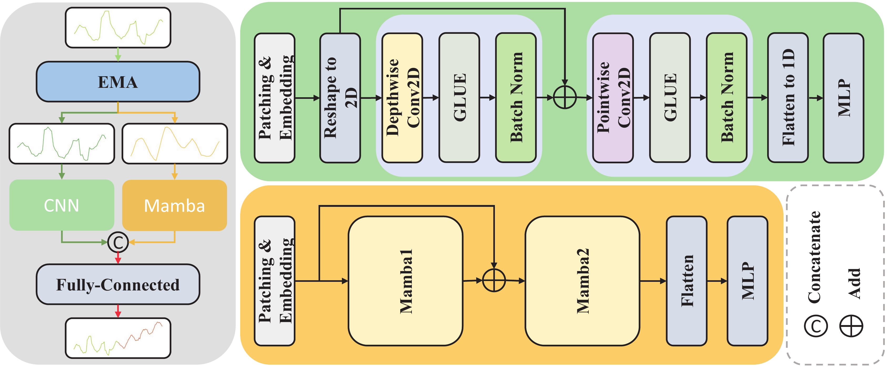
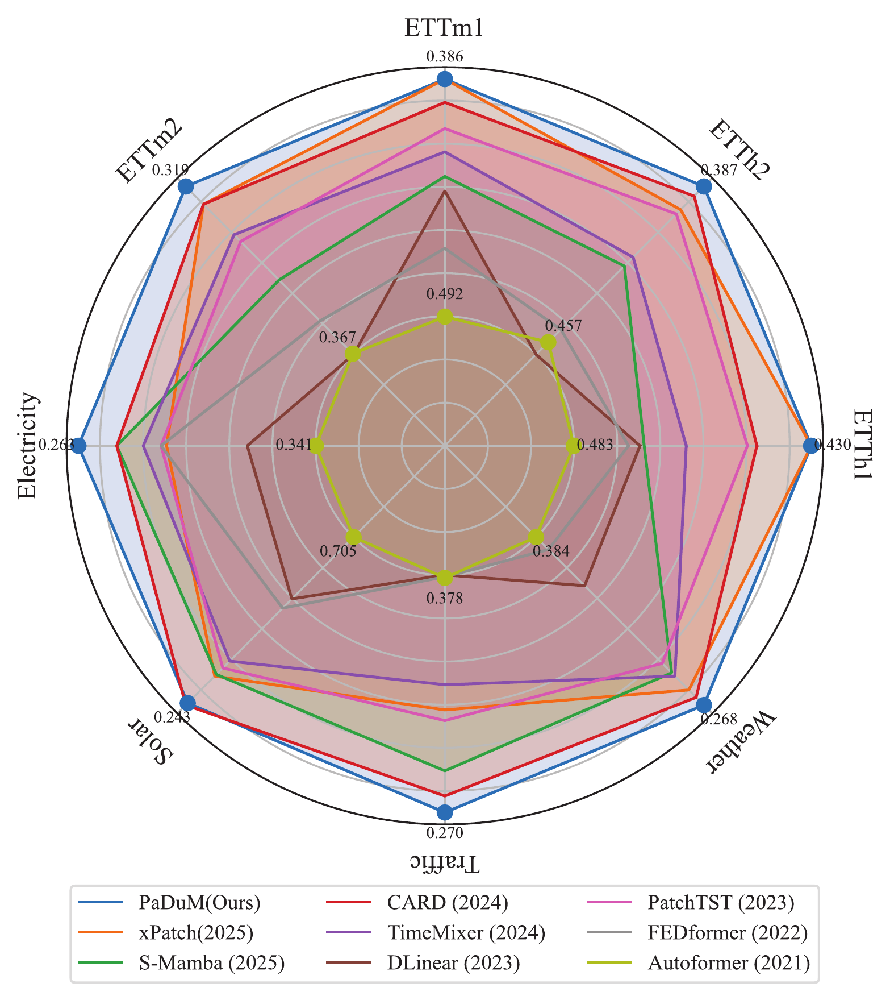
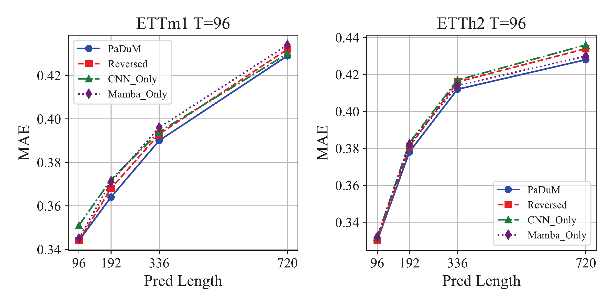
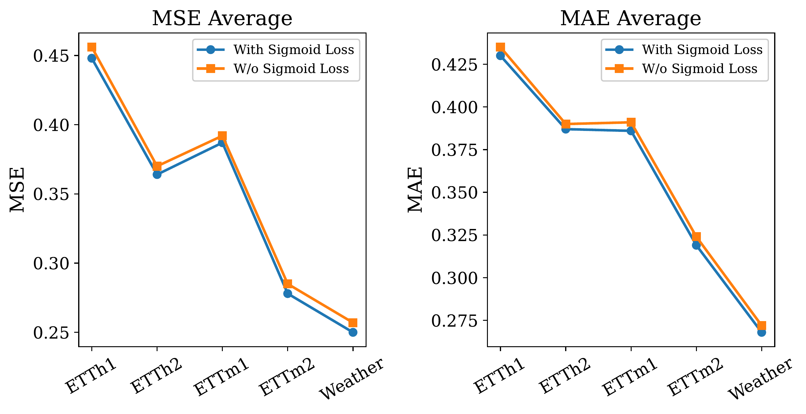
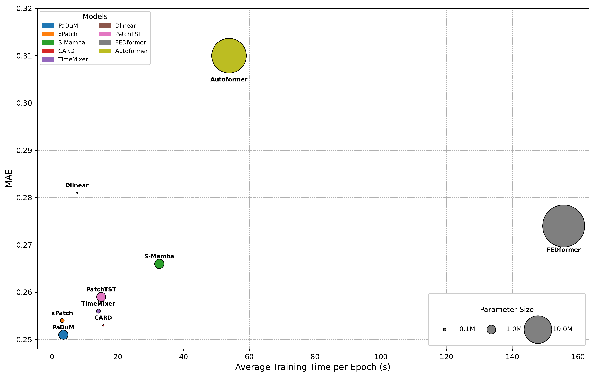
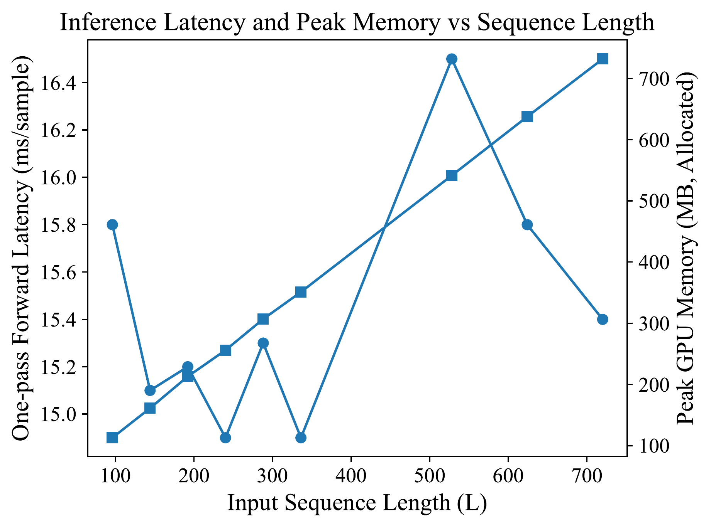

# PaDuM: Patch-Based Dual-Stream Network with CNN and Mamba for Time Series Forecasting

<div align="center">

[](https://2026.ieeeicassp.org/)
[](./Template.pdf)
[](LICENSE)

**Junliang Tao, Li Cao, Hongbing Wang, Chenhao Xie, Jian Li, Liang Zhou**

*School of Big Data and Computer Science, Guizhou Normal University, Guiyang, China*

</div>

## 📝 Abstract

Recently, Transformer-based models have shown limitations in efficiency, while Mamba offers strong potential with its linear complexity and selective mechanism. Meanwhile, convolutional neural networks (CNNs) excel at capturing local dependencies. To integrate their complementary strengths, we propose **PaDuM**, a **Pa**tch-Based **Du**al-Stream Network with CNN and **M**amba. PaDuM employs exponential moving average (EMA) to decouple sequences into trend and seasonal components, which are then processed through patching and modeled jointly by CNN and Mamba. Furthermore, we design a Sigmoid-based weight decay loss to emphasize recent predictions and enhance stability. Extensive experiments on eight real-world datasets from electricity, traffic, and meteorology domains demonstrate that PaDuM achieves state-of-the-art performance with strong robustness and generalization.

## 🌟 Highlights

- **First Patch-Based Dual-Stream Architecture**: PaDuM is the first model combining CNN and Mamba in a patch-based dual-stream framework for time series forecasting.

- **EMA Decomposition**: Uses Exponential Moving Average to decouple time series into trend and seasonal components, providing more discriminative representations.

- **Sigmoid Loss Function**: Novel Sigmoid-based loss that emphasizes short-term predictions, improving MAE while maintaining stable optimization.

- **State-of-the-Art Performance**: Achieves best MAE on most of 8 real-world datasets across electricity, traffic, and meteorology domains.

- **Efficient Architecture**: Linear complexity with Mamba and lightweight CNN, achieving favorable accuracy-efficiency trade-off.

## 🏗️ Architecture

<div align="center">

<p><em>Overview of the PaDuM framework. The input time series is decomposed into seasonal and trend components, modeled by CNN and Mamba streams, respectively.</em></p>
</div>

### Key Components:

1. **EMA Decomposition**: Separates input into trend (long-term dependencies) and seasonal (periodic patterns) components

2. **CNN Stream**: Processes seasonal component using depthwise separable convolutions to capture local patterns

3. **Mamba Stream**: Models trend component with state space models for efficient long-range dependency modeling

4. **Fusion Layer**: Concatenates and merges features from both streams via fully connected layer

## 📊 Main Results

### Long-term Forecasting (Look-back Window L=96)

| Models | PaDuM (Ours) | xPatch | S-Mamba | CARD | TimeMixer | DLinear | PatchTST | FEDformer | Autoformer |
|--------|:---:|:---:|:---:|:---:|:---:|:---:|:---:|:---:|:---:|
| **1st Count** | **9** | 2 | 2 | 2 | 3 | 0 | 1 | 1 | 0 |

<details>
<summary>📈 Detailed Results (Click to expand)</summary>

| Dataset | Metric | PaDuM | xPatch | S-Mamba | CARD | TimeMixer | DLinear | PatchTST | FEDformer | Autoformer |
|---------|--------|:---:|:---:|:---:|:---:|:---:|:---:|:---:|:---:|:---:|
| ETTh1 | MSE | 0.448 | 0.444 | 0.457 | 0.449 | 0.458 | 0.460 | 0.445 | 0.436 | 0.493 |
| ETTh1 | MAE | **0.430** | **0.430** | 0.452 | 0.435 | 0.444 | 0.453 | 0.436 | 0.456 | 0.483 |
| ETTh2 | MSE | 0.364 | 0.369 | 0.383 | **0.360** | 0.385 | 0.496 | 0.362 | 0.424 | 0.442 |
| ETTh2 | MAE | **0.387** | 0.392 | 0.408 | 0.389 | 0.405 | 0.479 | 0.393 | 0.443 | 0.457 |
| ETTm1 | MSE | 0.387 | 0.390 | 0.398 | 0.391 | 0.386 | 0.406 | **0.381** | 0.408 | 0.533 |
| ETTm1 | MAE | **0.386** | **0.386** | 0.406 | 0.390 | 0.400 | 0.410 | 0.395 | 0.431 | 0.492 |
| ETTm2 | MSE | **0.278** | 0.280 | 0.290 | **0.278** | **0.278** | 0.311 | 0.280 | 0.292 | 0.323 |
| ETTm2 | MAE | **0.319** | 0.321 | 0.333 | 0.321 | 0.325 | 0.368 | 0.326 | 0.345 | 0.367 |
| Electricity | MSE | 0.178 | 0.198 | **0.172** | 0.177 | 0.182 | 0.209 | 0.188 | 0.188 | 0.234 |
| Electricity | MAE | **0.263** | 0.276 | 0.268 | 0.268 | 0.272 | 0.296 | 0.275 | 0.275 | 0.341 |
| Solar | MSE | 0.250 | 0.294 | 0.244 | 0.243 | **0.234** | 0.330 | 0.250 | 0.292 | 0.878 |
| Solar | MAE | **0.243** | 0.273 | 0.275 | 0.241 | 0.292 | 0.402 | 0.283 | 0.381 | 0.705 |
| Traffic | MSE | 0.524 | 0.494 | **0.412** | 0.440 | 0.504 | 0.625 | 0.462 | 0.610 | 0.614 |
| Traffic | MAE | **0.270** | 0.293 | 0.278 | 0.273 | 0.301 | 0.384 | 0.290 | 0.380 | 0.378 |
| Weather | MSE | 0.250 | 0.254 | 0.252 | 0.248 | **0.245** | 0.267 | 0.258 | 0.309 | 0.342 |
| Weather | MAE | **0.268** | 0.272 | 0.277 | 0.270 | 0.276 | 0.317 | 0.280 | 0.356 | 0.384 |

</details>

### Performance Highlights

<div align="center">

<p><em>Average MAE comparison between PaDuM and state-of-the-art baselines with look-back window size T=96.</em></p>
</div>

## 🔬 Ablation Studies

### Architecture Design

<div align="center">

</div>

| Variant | Description |
|---------|-------------|
| **PaDuM** | Seasonality → CNN, Trend → Mamba |
| Reversed | Seasonality → Mamba, Trend → CNN |
| CNN Only | Both → CNN |
| Mamba Only | Both → Mamba |

**Finding**: Original PaDuM configuration achieves best performance by leveraging CNN's strength in local patterns and Mamba's efficiency in long-term dependencies.

### Sigmoid Loss Effectiveness

<div align="center">

</div>

The Sigmoid Loss enhances forecasting performance with notable improvements in long-term accuracy, confirming its effectiveness in focusing on recent predictions.

## ⚡ Efficiency Analysis

<div align="center">


</div>

- **Training**: PaDuM achieves lowest MAE with fewer parameters and shorter training time
- **Inference**: One-pass latency remains nearly constant (~15ms), GPU memory increases linearly with input length

## 🛠️ Installation

### Prerequisites

- Python 3.8+
- PyTorch 1.9+
- CUDA 11.0+ (for GPU acceleration)

### Setup

```bash
# Clone the repository
git clone https://github.com/T-DXVN/PaDuM.git
cd PaDuM

# Create conda environment (recommended)
conda create -n padum python=3.8
conda activate padum

# Install dependencies
pip install -r requirements.txt
```

## 🚀 Quick Start

### Data Preparation

Download the datasets from [Google Drive](https://drive.google.com/drive/folders/13CgB3IDNNpFGLem5MWdBXPcDh72D1sSm) or [Baidu Drive](https://pan.baidu.com/s/1r318GGN-0tEbGh0mwjNHow?pwd=ic84).

Place the data in `./dataset/` folder.

### Training

```bash
# Train on ETTh1 dataset
python run.py --model PaDuM --data ETTh1 --features M --seq_len 96 --pred_len 96

# Train on multiple prediction lengths
for pred_len in 96 192 336 720; do
    python run.py --model PaDuM --data ETTh1 --pred_len $pred_len
done
```

### Evaluation

```bash
# Evaluate trained model
python run.py --model PaDuM --data ETTh1 --pred_len 96 --is_training 0 --checkpoint ./checkpoints/PaDuM_ETTh1_96.pth
```

### Key Arguments

| Argument | Description | Default |
|----------|-------------|---------|
| `--model` | Model name | `PaDuM` |
| `--data` | Dataset name | `ETTh1` |
| `--seq_len` | Look-back window | `96` |
| `--pred_len` | Prediction horizon | `96` |
| `--features` | Feature type (`M`/`S`/`MS`) | `M` |
| `--enc_in` | Number of input features | `7` |
| `--d_model` | Model dimension | `512` |
| `--n_layers` | Number of Mamba layers | `2` |
| `--learning_rate` | Learning rate | `1e-4` |
| `--batch_size` | Batch size | `32` |
| `--train_epochs` | Training epochs | `100` |

## 📁 Project Structure

```
PaDuM/
├── models/
│   ├── PaDuM.py          # Main PaDuM model
│   ├── layers/
│   │   ├── CNN.py         # CNN stream
│   │   ├── Mamba.py       # Mamba stream
│   │   └── Embed.py       # Patch embedding
│   └── losses/
│       └── SigmoidLoss.py # Sigmoid loss function
├── dataset/               # Dataset folder
├── checkpoints/           # Saved models
├── results/               # Experiment results
├── utils/                 # Utilities
├── run.py                 # Main training script
├── requirements.txt       # Dependencies
└── README.md              # This file
```

## 📖 Citation

If you find this work useful, please cite our paper:

```bibtex
@inproceedings{tao2026padum,
  title={PaDuM: Patch-Based Dual-Stream Network with CNN and Mamba for Time Series Forecasting},
  author={Tao, Junliang and Cao, Li and Wang, Hongbing and Xie, Chenhao and Li, Jian and Zhou, Liang},
  booktitle={IEEE International Conference on Acoustics, Speech and Signal Processing (ICASSP)},
  year={2026},
  organization={IEEE}
}
```

## 🙏 Acknowledgements

This work was supported by:
- National Natural Science Foundation of China (U22A2026, 62072097)
- QIANHEHE PLATFORM TALENT BQW[2024]015
- GZNU[2024]01

We thank the developers of [Time Series Library (TS-Lib)](https://github.com/thuml/Time-Series-Library) for their excellent codebase.

## 📧 Contact

For questions or collaborations, please contact:

- **Corresponding Author**: Hongbing Wang (hbwang@gznu.edu.cn)
- **First Author**: Junliang Tao

## 📄 License

This project is licensed under the MIT License - see the [LICENSE](LICENSE) file for details.

---

<div align="center">

**⭐ Star this repository if you find it helpful!**

</div>
